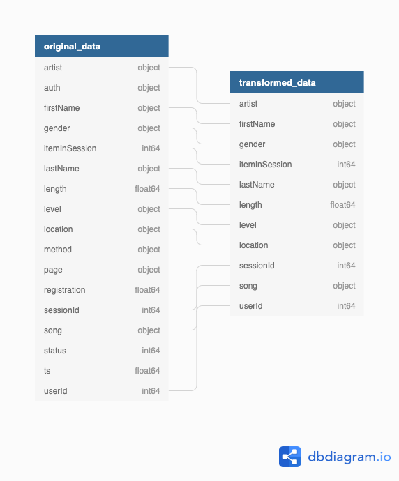
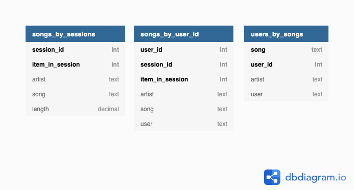

# cassandra_NoSQL_data_modeling

### Table of Contents

- Introduction - purpose of project, What is Sparkify, how this project is going to help them.
- Database schema design and ETL process
- Files in repository
- How to run the python scripts

### Introduction: Sparkify and user data

Sparkify is a (fictional) startup that offers music streaming services. They accumulate 
data but do not yet leverage them. The data is stored in a csv table. I have created a
NoSQL data model which is explained below.

Cassandra is a NoSQL database. You can read on the [cassandra website](https://cassandra.apache.org/): _"The Apache Cassandra database is the right choice when you need scalability and high availability without compromising performance."_

The data model in this repository enables Sparkify to perform three analyses.
One analysis enables Sparkify to examine every listening session and see which
artists and songs are being played most. Another analysis is about user behaviour,
Sparkify can see to which songs the users listen to. Finally, Sparkify can analyse
how popular specific songs are. 

Now that we have learned more about Sparkify I will present more details about the
data in the next chapter.

### Database Schema Design and ETL Process

There are two steps in this ETL-process. Firstly, we prepare the original data by
reducing the number of columns and by combining all individual csv files into one
csv file. Secondly, we create a Cassandra key space and three tables and upload
all the data from the csv to Cassandra. 

The original data is stored in csv files partitioned by day (`data/event_data/`).

Here is an image that shows the pre-processing:

We will eventually make three separate tables from the data shown in the image above. 
In NoSQL / Cassandra databases it's common practice to have one table per query.
Here are the three tables:

1. __Sessions:__ This table enables to filter by sessions.
2. __Songs:__ This table enables to filter by songs.
3. __Users:__ This table enables to filter by songs.

### Files in this repository

There are four folders in this repository.

- __data__ holds the original data.
- __notebooks__ holds all jupyter notebook. These are files ending in `ipynb`.
- __documentation__ contains pictures, screenshots, diagrams, etc.

Inside __notebooks__ you will find two files. Here is a brief explanation of 
both notebooks:

- `1_Pre_Process_Files.ipynb` combines all csv files into one table and reduces the number of columns. 
- `2_Cassandra_NoSQL_Data_Model.ipynb` connects to Cassandra, creates all tables, inserts data, selects data with a query and finally drops all tables.

### How to run the notebooks

To run the notebooks, you need to have a local installation of Cassandra as well as Python. Additionally, you need to make sure that your virtual environment has some packages installed. 

I recommend using [Docker Desktop](https://www.docker.com/products/docker-desktop) to create an instance of Cassandra:

`docker run --name cassandra -p 127.0.0.1:9160:9160 -d cassandra`

The packages you need to run the notebooks are:

- Jupyter Lab (or Jupyter Notebook)
- Pandas
- Cassandra Client
  
`pip install jupyterlab pandas cassandra`

or

`conda install jupyterlab pandas cassandra`

Once you have all required packages installed, go with your terminal to the root directory of the project and type `jupyterlab`. You can then open the notebook in your browser by visiting localhost:8888 (depending on your settings of jupyter lab). 
